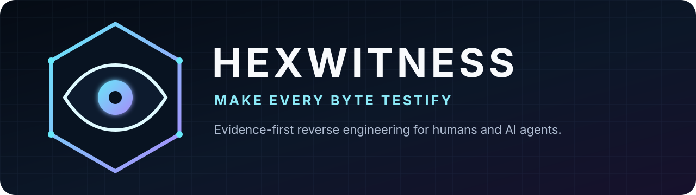
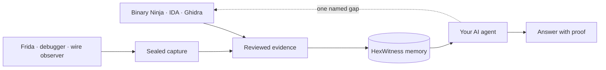

<div align="center">
  
</div>

<p align="center">
  <a href="https://github.com/siaginw/HexWitness/actions/workflows/ci.yml"></a>
  <a href="LICENSE"></a>
  
  
  <a href="https://www.npmjs.com/package/hexwitness"></a>
</p>

<p align="center">
  <strong>Give your reverse-engineering agent a memory, a map, and receipts.</strong><br>
  HexWitness turns static analysis, runtime captures, and human conclusions into one durable evidence graph.
</p>

<p align="center">
  <a href="#see-it-work-in-60-seconds">Quick start</a> ·
  <a href="#why-hexwitness-feels-different">Why it matters</a> ·
  <a href="#ask-real-questions">Examples</a> ·
  <a href="docs/GETTING-STARTED.md">Docs</a> ·
  <a href="docs/WHY-HEXWITNESS.md">How it compares</a>
</p>

---

Yesterday, your agent found the parser, mapped its callers, and proved which runtime event reached it. Today, a new chat opens and asks the live disassembler to discover everything again.

HexWitness stops that loop.



The live viewer remains the agent's eyes. HexWitness becomes its case file: tied to an exact build, searchable across tools, honest about conflicts, and ready for the next agent.

## See it work in 60 seconds

Requirements: Git and Node.js 22.13 or newer.

```bash
npm install --global hexwitness
hexwitness setup
hexwitness demo
```

The setup wizard connects HexWitness to Codex, Claude Code, Cursor, VS Code/Copilot, Claude Desktop, or generic MCP clients. It also installs guidance written for that agent. The MCP entry starts the local read-only daemon when needed, so there is no service choreography.

Now ask:

```text
Use HexWitness to explain 0x401120 in build toy-v1.
Show proof, contradictions, and missing evidence separately.
```

The demo uses synthetic, redistributable evidence. No third-party binary data ships with HexWitness.

Prefer a checkout?

```bash
git clone https://github.com/siaginw/HexWitness.git
cd HexWitness
npm install
npm run demo
npm run setup
```

HexWitness installs as one command. The service, MCP transport, installer, capture pipeline, and adapter catalog live behind that command:

```bash
hexwitness agent                 # daemon autostart + MCP for AI clients
hexwitness serve                 # REST daemon only
hexwitness adapters              # list every included viewer/runtime adapter
hexwitness adapters binary-ninja # print one adapter's exact path and capabilities
hexwitness contract              # inspect the stable 1.x public contract
hexwitness backup ./evidence.db  # create and verify a consistent snapshot
```

The npm package ships one bundled runtime instead of exposing its internal module tree. Python remains only in the thin Binary Ninja, IDA, and Ghidra exporters because those products expose their supported automation APIs through Python.

## Why HexWitness feels different

Most RE integrations solve **access**: let an agent read a decompiler, debugger, or trace. HexWitness solves **continuity**: keep the useful result after that tool, build, or chat is gone.

| Approach | Excellent for | The gap HexWitness fills |
|---|---|---|
| Viewer MCP | Live decompilation, xrefs, renames, analysis control | Findings are session-scoped unless promoted |
| Notes and reports | Human narrative | Hard to query, compare, or trace back to exact evidence |
| General agent memory | Preferences and broad project context | No dedicated build, address, call-graph, capture, or provenance contract |
| HexWitness | Durable RE evidence and runtime reconstruction | Pairs with viewers instead of replacing them |

That makes HexWitness especially useful when:

- the binary changes and addresses move;
- several agents or analysts share work;
- static code must line up with runtime behavior;
- a conclusion needs a reproducible chain of evidence;
- a failed capture must be compared with a working one;
- “we think” needs to become “we proved.”

Read the honest category comparison in [Why HexWitness](docs/WHY-HEXWITNESS.md).

## Ask real questions

Users ask about the target. The agent chooses the tools.

```text
Which function validates frame length before dispatch?
Reuse retained evidence first. Inspect a live viewer only if one exact edge is missing.
```

```text
Compare the working and failing login captures.
Find the first meaningful divergence, then resolve its static consumer.
```

```text
Where is this UUID used, which class owns it, and did its field offset change
between builds?
```

HexWitness gives agents first-class queries for builds, functions, classes, UUIDs, types, fields, vtables, calls, xrefs, paths, dataflow, captures, contradictions, coverage, and evidence gaps. Three MCP prompts package complete investigation, runtime comparison, and live-finding promotion workflows.

## One investigation loop

1. **Remember.** Query retained evidence before touching a live tool.
2. **Pin.** Select the exact artifact build; never carry an address across builds by habit.
3. **Resolve.** Search the subject, then read its full evidence dossier.
4. **Narrow.** Traverse only the calls, fields, slices, or capture window needed.
5. **Challenge.** Surface provenance, confidence, and contradictory claims.
6. **Escalate.** If proof ends, name the smallest missing live observation.
7. **Promote.** Export that bounded result so the next investigation starts smarter.

The database remembers evidence. A separate privacy-safe activity store remembers operation hashes, timing, status, and counts—never prompts, arguments, or returned evidence.

## Runtime capture without command soup

Collectors place conventional files and a small manifest in one private folder:

```text
roundtrip/
├── capture.json
├── wire.jsonl
├── hooks.jsonl
├── screen.mp4
└── context.json
```

Then:

```bash
hexwitness capture ./private/roundtrip
```

HexWitness checks the required roles and action markers, copies artifacts into an isolated private pack, normalizes a safe timeline by removing secret fields and replacing payloads with length plus SHA-256, seals checksums, verifies integrity, and imports the evidence. Missing or empty baseline artifacts fail closed. A failed normalization leaves the source pack recoverable.

See [Capture packs](docs/CAPTURE-PACKS.md) for collector and scenario contracts.

## Works with your stack

| Tool | Durable bridge |
|---|---|
| Binary Ninja | Deep JSONL exporter plus optional official Binary Ninja MCP live viewer |
| IDA / IDAPython | JSONL exporter plus optional Hex-Rays-endorsed IDA Pro MCP |
| Ghidra | Functions, calls, blocks, types, fields, and enum exporter |
| Frida | Narrow semantic-event observer and JSONL normalizer |
| Other tools | Versioned adapter manifest and vendor-neutral JSONL schema |

HexWitness does not ship a weaker disassembler inside the project. Viewer MCPs provide live eyes. Exporters turn reviewed findings into portable memory. Read [Viewer MCP bridges](docs/VIEWER-MCP.md) and the [Adapter SDK](docs/ADAPTER-SDK.md).

## One truth, three interfaces

| Interface | Best use |
|---|---|
| MCP | Agent-led investigations with read-only tool annotations and tailored skills |
| CLI | Import, capture lifecycle, automation, recovery, and direct queries |
| REST | Local read-only integration with a published route manifest |

All three read the same SQLite evidence graph. Imports are transactional and idempotent. Addresses remain canonical hexadecimal strings, including unsigned 64-bit values.

## Evidence, not vibes

- **Build** — exact artifact identity and analysis provenance.
- **Entity** — function, type, class, field, vtable, runtime object, or project-defined object.
- **Edge** — call, reference, ownership, inheritance, dataflow, or runtime relationship.
- **Evidence** — an observation with source, time, classification, and confidence.
- **Claim** — an interpretation linked to supporting or opposing evidence.
- **Capture** — a sealed scenario with artifacts, markers, events, and checksums.
- **Gap** — the next missing fact needed to prove a behavior.

Conflicting claims remain visible. Unknown behavior becomes a worklist, not a fabricated answer.

## Private by default

```text
raw private material  →  normalized project evidence  →  synthetic public fixtures
```

- Daemon binds to localhost and serves GET-only queries.
- Non-local binding requires an API token and still needs trusted TLS transport.
- Executable bytes and decompiler text are not exported by default.
- Capture normalization recursively removes common secret and payload fields.
- Public-release audit blocks credentials, captures, dumps, proprietary binary formats, large embedded payloads, and personal paths.

Read [Privacy](docs/PRIVACY.md) and [Security](SECURITY.md) before importing sensitive work.

## Documentation

| Start here | What it answers |
|---|---|
| [Getting started](docs/GETTING-STARTED.md) | Can I prove the full local loop? |
| [Why HexWitness](docs/WHY-HEXWITNESS.md) | Why not just use notes, a viewer MCP, or generic memory? |
| [AI setup wizard](docs/INSTALLER.md) | What gets installed for each agent? |
| [AI-first workflows](docs/AI-FIRST-WORKFLOWS.md) | What should I ask the agent? |
| [Capability matrix](docs/CAPABILITY-MATRIX.md) | What is complete, variable, or intentionally out of scope? |
| [Quality contract](docs/QUALITY.md) | Which claims are machine-checked? |
| [Stability policy](docs/STABILITY.md) | What remains compatible throughout 1.x? |
| [Compatibility](docs/COMPATIBILITY.md) | Which runtimes and viewer boundaries are supported? |
| [Release readiness](docs/RELEASE-READINESS.md) | What does the 1.0 claim include? |
| [CLI](docs/CLI.md), [REST](docs/API.md), [MCP](docs/MCP.md) | What interfaces are available? |
| [Architecture](docs/ARCHITECTURE.md) | How do the pieces fit? |
| [Troubleshooting](docs/TROUBLESHOOTING.md) | What failed and how do I prove it? |

## Project status

HexWitness 1.0 is a stable public developer release. Automated gates cover schema migration, importer, evidence graph, query engine, capture lifecycle, unified CLI, bundled distribution, read-only daemon, concurrent query behavior, MCP server, setup wizard, tailored agent skills, privacy audit, packaging, installed upgrade, and the CLI → DB → daemon → MCP journey. The exact trust boundary is documented in [Release readiness](docs/RELEASE-READINESS.md).

Commercial viewer APIs still vary by edition and release. HexWitness documents that boundary instead of claiming universal compatibility. See [Quality](docs/QUALITY.md) for the exact tested surface.

## Contributing

Focused issues and pull requests welcome. Read [CONTRIBUTING.md](CONTRIBUTING.md). Never attach proprietary binaries, vendor databases, credentials, or captures you cannot redistribute.

Apache-2.0. Analyzed binaries, imported evidence, vendor SDKs, and RE databases retain their own terms.

<p align="center">
  Built and maintained by <a href="https://github.com/siaginw">SiagiNW</a>.<br>
  <strong>Make every byte testify.</strong>
</p>
