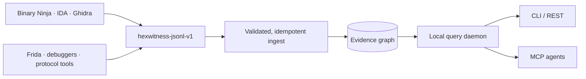

<div align="center">
  
</div>

<p align="center">
  <a href="https://github.com/siaginw/HexWitness/actions/workflows/ci.yml"></a>
  <a href="LICENSE"></a>
  
  
  
</p>

<p align="center">
  <strong>HexWitness turns static analysis, runtime observations, protocol traces, and human conclusions into one durable evidence graph.</strong><br>
  Query it from the CLI, a local REST daemon, or any MCP-capable coding agent.
</p>

<p align="center">
  <a href="#quick-start">Quick start</a> ·
  <a href="#give-it-a-binary">Analyze a binary</a> ·
  <a href="#connect-an-agent">Connect an agent</a> ·
  <a href="docs/GETTING-STARTED.md">Documentation</a> ·
  <a href="SECURITY.md">Security</a>
</p>

---

Reverse-engineering work rarely lives in one place. Function names sit in a decompiler. Runtime behavior lives in traces. Protocol findings land in scratch notes. Six weeks later, nobody remembers which build proved what.

HexWitness fixes that.



## Why HexWitness

| Capability | What it changes |
|---|---|
| **Build-scoped truth** | Every address and conclusion stays tied to an exact binary identity. |
| **One evidence dossier** | `explain` combines identity, signatures, callers, callees, xrefs, runtime hits, claims, and provenance. |
| **Agent-native access** | MCP tools give agents a small, predictable vocabulary instead of raw database access. |
| **Honest uncertainty** | Conflicting claims coexist and surface as contradictions instead of silently overwriting each other. |
| **Durable tool bridges** | Binary Ninja, IDA, Ghidra, and runtime tools export through one vendor-neutral JSONL contract. |
| **Private by design** | Raw binaries, captures, credentials, and vendor databases stay outside the public evidence layer. |

## Quick start

Requirements: Git and Node.js 22.13 or newer.

```bash
git clone https://github.com/siaginw/HexWitness.git
cd HexWitness
npm install
npm run demo
npm start
```

The daemon now listens on `http://127.0.0.1:7878`. In another terminal:

```bash
node bin/hexwitness.mjs search dispatch
node bin/hexwitness.mjs explain 0x401120 --build toy-v1
node bin/hexwitness.mjs gaps 0x401120 --build toy-v1 --objective runtime
```

Expected health check:

```bash
curl http://127.0.0.1:7878/v1/health
```

Want the `hexwitness` command while developing locally?

```bash
npm link
hexwitness doctor
```

The demo contains only synthetic, redistributable evidence. No third-party binary data ships with HexWitness.

## Give it a binary

1. Open a binary you are authorized to analyze.
2. Run the exporter for your reverse-engineering tool.
3. Ingest the resulting JSONL.
4. Ask HexWitness about the exact build.

| Tool | Exporter | Current status |
|---|---|---|
| Binary Ninja | [`adapters/binary-ninja/export_hexwitness.py`](adapters/binary-ninja/export_hexwitness.py) | Preview adapter |
| IDA / IDAPython | [`adapters/ida/export_hexwitness.py`](adapters/ida/export_hexwitness.py) | Preview adapter |
| Ghidra | [`adapters/ghidra/ExportHexWitness.py`](adapters/ghidra/ExportHexWitness.py) | Preview adapter |
| Frida JSONL | [`adapters/frida-jsonl/normalize.mjs`](adapters/frida-jsonl/normalize.mjs) | Covered by synthetic workflow |

```bash
hexwitness init
hexwitness ingest ./program.hexwitness.jsonl
hexwitness serve
```

The static exporters include build hash, architecture, image base, functions, and supported graph relationships. They do **not** include executable bytes. Decompiled text remains opt-in.

Read [What agents need from a binary](docs/BINARY-DUMP-GUIDE.md) before designing a large export. Agents can also call `hexwitness_dump_guide` or `hexwitness_gap_report` to request the smallest useful next dump.

## Connect an agent

Start the daemon, then add the stdio MCP adapter to your client:

```json
{
  "mcpServers": {
    "hexwitness": {
      "command": "node",
      "args": ["/absolute/path/to/HexWitness/bin/hexwitness-mcp.mjs"],
      "env": {
        "HEXWITNESS_URL": "http://127.0.0.1:7878",
        "HEXWITNESS_AGENT_SESSION": "my-analysis-project"
      }
    }
  }
}
```

The agent receives these tools:

| MCP tool | Purpose |
|---|---|
| `hexwitness_health` | Verify service health and evidence counts |
| `hexwitness_builds` | Select the exact indexed binary build |
| `hexwitness_search` | Resolve functions, symbols, strings, types, and addresses |
| `hexwitness_explain` | Retrieve a complete evidence dossier |
| `hexwitness_callers` / `hexwitness_callees` | Traverse direct call relationships |
| `hexwitness_xrefs` | Traverse code and data references |
| `hexwitness_evidence` | Inspect observations, provenance, and confidence |
| `hexwitness_contradictions` | Find active claims that disagree |
| `hexwitness_gap_report` | Identify the smallest missing evidence for an objective |
| `hexwitness_dump_guide` | Get a vendor-neutral export checklist |
| `hexwitness_activity_summary` | Inspect privacy-preserving operation statistics |

HexWitness also publishes the `hexwitness_start_investigation` prompt, which guides an agent through build selection, search, explanation, focused traversal, evidence review, and contradiction checks.

See the [MCP guide](docs/MCP.md) and [agent contract](AGENTS.md).

## What `explain` returns

```json
{
  "entity": {
    "name": "dispatch_request",
    "address": "0x401120",
    "signature": "int dispatch_request(Request *request)"
  },
  "callers": ["main"],
  "callees": ["decode_message"],
  "runtime": ["toy-capture-1:event:1"],
  "claims": [
    { "predicate": "handles_message_kind", "object": 7, "status": "verified" }
  ],
  "summary": {
    "incoming_edges": 1,
    "outgoing_edges": 2,
    "evidence_items": 1,
    "runtime_hits": 1
  }
}
```

The exact API response includes full IDs, provenance, metadata, and edge records. The example above is shortened for readability.

## Evidence model

- **Build** — exact artifact identity and analysis provenance.
- **Entity** — function, symbol, string, type, class, field, global, or protocol object.
- **Edge** — call, code reference, data reference, ownership, inheritance, or correlation.
- **Evidence** — an observed fact with source, timestamp, classification, and confidence.
- **Claim** — an interpretation linked to supporting or opposing evidence.
- **Capture event** — an ordered runtime observation tied to a scenario and build.
- **Contradiction** — active claims sharing a subject and predicate but disagreeing on value.

Addresses are stored as canonical hexadecimal strings, preserving unsigned 64-bit values. Repeated imports are idempotent.

## Privacy boundary

HexWitness has three evidence zones:

```text
raw private material  ->  derived project evidence  ->  synthetic/public fixtures
```

- HTTP binds to localhost and exposes query operations only.
- Ingestion is a local CLI operation.
- Activity history stores operation names, argument hashes, timing, result counts, and an optional session hash—not prompts, arguments, returned evidence, or raw bytes.
- A non-local bind requires `HEXWITNESS_API_TOKEN`.
- Common binary, capture, database, credential, and payload patterns are blocked by the public-release audit.

Read the [privacy model](docs/PRIVACY.md) and [security policy](SECURITY.md).

## Documentation

| Guide | Use it when… |
|---|---|
| [Getting started](docs/GETTING-STARTED.md) | You want a verified first run |
| [CLI reference](docs/CLI.md) | You need exact command syntax |
| [HTTP API](docs/API.md) | You are integrating scripts or another tool |
| [MCP integration](docs/MCP.md) | You are connecting an AI agent |
| [Binary dump guide](docs/BINARY-DUMP-GUIDE.md) | You need to know what to export |
| [Adapter SDK](docs/ADAPTER-SDK.md) | You are adding another RE tool |
| [Capture pipeline](docs/CAPTURE-PIPELINE.md) | You are correlating runtime behavior |
| [Architecture](docs/ARCHITECTURE.md) | You want system boundaries and rationale |
| [Tool bridges](docs/TOOL-BRIDGES.md) | You are pairing HexWitness with a live RE MCP/plugin |
| [Troubleshooting](docs/TROUBLESHOOTING.md) | Something does not start, ingest, or resolve |

## Project status

HexWitness `0.1` is a preview release. The core database, importer, CLI, daemon, MCP surface, privacy audit, and synthetic workflow have automated coverage. Vendor GUI adapters are intentionally labeled preview until their compatibility matrix is tested against specific Binary Ninja, IDA, and Ghidra releases.

No benchmark, adoption, or compatibility claim is implied beyond the checks published in this repository.

## Contributing

Issues and focused pull requests are welcome. Read [CONTRIBUTING.md](CONTRIBUTING.md) before submitting an adapter or fixture. Never attach proprietary binaries, vendor databases, credentials, or captures you cannot redistribute.

## License

Apache-2.0. Analyzed binaries, imported evidence, vendor SDKs, and reverse-engineering databases retain their own terms and are not part of HexWitness.

<p align="center">
  Built and maintained by <a href="https://github.com/siaginw">siaginw</a>.<br>
  <strong>Make every byte testify.</strong>
</p>
