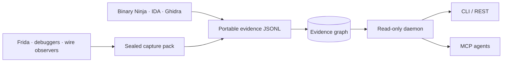

<div align="center">
  
</div>

<p align="center">
  <a href="https://github.com/siaginw/HexWitness/actions/workflows/ci.yml"></a>
  <a href="LICENSE"></a>
  
  
  
</p>

<p align="center">
  <strong>AI-led evidence memory for reverse engineering.</strong><br>
  Ask the question once. Your agent reuses static analysis, runtime traces, protocol observations, and proven conclusions before touching a live viewer.
</p>

<p align="center">
  <a href="#let-the-agent-drive">AI workflow</a> ·
  <a href="#quick-start">Quick start</a> ·
  <a href="#capture-runtime-behavior">Capture runtime behavior</a> ·
  <a href="#connect-an-agent">Connect an agent</a> ·
  <a href="docs/CAPABILITY-MATRIX.md">Capability matrix</a> ·
  <a href="docs/GETTING-STARTED.md">Documentation</a>
</p>

---

Function names live in a decompiler. Runtime behavior lives in traces. Protocol findings land in scratch files. Weeks later, the build changed and nobody remembers which observation proved the conclusion.

HexWitness turns that scattered work into durable, evidence-backed knowledge.



## What it does

| Capability | Result |
|---|---|
| **Build-scoped truth** | Every address, type, event, and claim stays attached to an exact artifact identity. |
| **Deep static graph** | Functions, blocks, calls, references, types, classes, fields, vtables, dataflow, and bounded analysis slices. |
| **Sealed capture packs** | Wire, semantic hooks, markers, video, context, checksums, quality gates, and safe normalization. |
| **Runtime reconstruction** | Ordered timelines, request/response links, object relationships, search, comparison, and first divergence. |
| **One evidence dossier** | `explain` combines identity, graph, runtime hits, claims, contradictions, and provenance. |
| **Agent-native access** | A read-only daemon and MCP vocabulary for query, class, UUID, types, captures, gaps, and coverage. |
| **Honest uncertainty** | Conflicting claims remain visible. Missing evidence becomes a concrete worklist, never a guessed answer. |
| **Vendor-neutral interchange** | JSONL and adapter manifests prevent lock-in to one disassembler, debugger, or target. |

HexWitness is target-agnostic. No application, game, protocol, address, packet layout, or private evidence is built into the core.

## Let the agent drive

HexWitness is not intended to make a person memorize another command vocabulary. Connect its MCP server, describe the investigation, and let the agent choose the evidence sequence:

```text
Use HexWitness to determine which function validates message length before dispatch
and whether the failing capture reached it. Select the exact build and reuse retained
evidence first. If the proof is missing and Binary Ninja or IDA is connected, inspect
only the smallest missing scope read-only, then prepare the bounded export that makes
the result durable. Separate proof, inference, contradictions, and unknowns.
```

The agent performs:

```text
memory → exact build → resolve → explain → focused evidence → answer
                                              ↓ missing
                                      live viewer read-only
                                              ↓
                                      bounded promotion
```

Three MCP prompts package the high-value workflows:

- `hexwitness_start_investigation` drives a complete static or mixed investigation;
- `hexwitness_compare_runtime_behavior` finds the first divergence between working and failing captures;
- `hexwitness_promote_live_finding` turns a transient Binary Ninja or IDA result into a minimal durable handoff.

See [AI-first workflows](docs/AI-FIRST-WORKFLOWS.md) for realistic protocol, crash, class-recovery, vulnerability, and team-handoff examples. Connect [Binary Ninja or IDA MCP](docs/VIEWER-MCP.md) as optional live eyes.

## Durable memory: investigate once, reuse it

HexWitness is not just a search wrapper around a live disassembler. It is persistent project memory.

1. An exporter or capture pack turns a finding into build-scoped evidence.
2. Idempotent ingestion stores entities, calls, types, UUIDs, offsets, runtime events, relationships, claims, and provenance in SQLite.
3. Humans and agents query that memory before asking Binary Ninja, IDA, Ghidra, Frida, or another live tool.
4. A live tool is called only when retained evidence cannot answer the question.
5. The new bounded result is exported and ingested, so the next investigation reuses it.

```bash
hexwitness memory
curl http://127.0.0.1:7878/v1/memory
```

MCP agents get the same view through `hexwitness_memory_status`. The response shows durable evidence counts, database size, latest ingest and capture, retention policy, and recent privacy-preserving activity.

One important boundary: HexWitness does not silently retain every proprietary viewer response. A live result becomes durable after the viewer adapter exports it or the result is otherwise ingested. Query activity is stored separately as operation hashes, timing, status, and result counts—never full arguments or returned evidence.

## Quick start

Requirements: Git and Node.js 22.13 or newer.

Install directly from GitHub and launch the wizard:

```bash
npm install --global github:siaginw/HexWitness
hexwitness setup
```

Or work from a source checkout:

```bash
git clone https://github.com/siaginw/HexWitness.git
cd HexWitness
npm install
npm run demo
npm run setup
```

The setup wizard asks which AI clients to configure and whether to add Binary Ninja or IDA live inspection. The installed `hexwitness-agent` entrypoint starts the local daemon automatically—no second terminal or background-service ceremony.

Then ask the agent:

```text
Use HexWitness to explain 0x401120 in build toy-v1. Separate proven evidence,
conflicting claims, and missing proof. Drive the investigation yourself.
```

The bundled demo is synthetic and redistributable. It contains no third-party binary data.

See the [AI setup wizard](docs/INSTALLER.md) for non-interactive installs, dry runs, safe replacement, and supported clients. Granular CLI commands remain available for CI, scripting, and recovery.

## Export a binary

Open a binary you are authorized to analyze, run an exporter, then ingest its JSONL:

| Tool | Adapter | Exports |
|---|---|---|
| Binary Ninja | [`export_hexwitness.py`](adapters/binary-ninja/export_hexwitness.py) | Functions, strings, imports, calls, references, blocks, types, fields, optional HLIL |
| IDA / IDAPython | [`export_hexwitness.py`](adapters/ida/export_hexwitness.py) | Functions, strings, imports, calls, references, blocks |
| Ghidra | [`ExportHexWitness.py`](adapters/ghidra/ExportHexWitness.py) | Functions, calls, blocks, types, fields, enums |
| Frida | [`observer.js`](adapters/frida-jsonl/observer.js) | Narrow semantic call events and markers; no arbitrary payload reads |

```bash
hexwitness init
hexwitness ingest ./program.hexwitness.jsonl
hexwitness serve
```

Exporters hash the input executable and do not embed its bytes. Decompiled text is opt-in. Read the [binary dump guide](docs/BINARY-DUMP-GUIDE.md) before designing a large export.

## Capture runtime behavior

Put the collector output and a tiny `capture.json` manifest in one folder:

```text
roundtrip/
├── capture.json
├── wire.jsonl
├── hooks.jsonl
├── screen.mp4
└── context.json
```

Then run one command:

```bash
hexwitness capture ./private/roundtrip
```

HexWitness detects the conventional files, applies the baseline gate, normalizes, seals, verifies, and imports the result atomically. Missing evidence fails closed without leaving a half-built output. Raw payload-like fields become length and SHA-256; common secret fields are removed recursively.

See [sealed capture packs](docs/CAPTURE-PACKS.md) for collector contracts, directory layout, scenario markers, and privacy rules.

## Query vocabulary

The CLI, REST daemon, and MCP server expose the same investigation concepts:

- `query`, `search`, `explain`, `callers`, `callees`, `xrefs`, and bounded `reach`;
- `memory` status showing retained evidence and query-before-live-tool policy;
- `functions`, `classes`, `class`, `uuid`, `types`, `vtable`, `dataflow`, and `slices`;
- `evidence`, `contradictions`, `gaps`, `worklist`, and `coverage`;
- capture list, detail, timeline, search, graph, compare, and first divergence.

The daemon publishes its current route manifest at `GET /v1/routes`.

## Connect an agent

The setup wizard installs this autostart MCP entry automatically. The equivalent manual configuration is:

```json
{
  "mcpServers": {
    "hexwitness": {
      "command": "node",
      "args": ["/absolute/path/to/HexWitness/bin/hexwitness-agent.mjs"],
      "env": {
        "HEXWITNESS_AGENT_SESSION": "my-analysis-project"
      }
    }
  }
}
```

An agent starts with health and memory status, selects an exact build, resolves a target, reads its dossier, and only then performs focused graph or capture queries. [`AGENTS.md`](AGENTS.md) contains the full evidence discipline.

For a combined workspace with optional live viewers, copy [`.mcp.ai-first.json.example`](.mcp.ai-first.json.example). The recommended pairings are [BinAssistMCP for Binary Ninja and `ida-pro-mcp`/`idalib-mcp` for IDA](docs/VIEWER-MCP.md). These third-party viewers provide live context; HexWitness provides durable memory, build identity, provenance, contradiction handling, and promotion.

HexWitness's core is Node.js. The small Python files are viewer-native exporters for Binary Ninja, IDA, and Ghidra—not a second command framework users must operate by hand.

## Evidence model

- **Build** — exact artifact identity and analysis provenance.
- **Entity** — static or runtime object with a build-scoped stable key.
- **Edge** — call, reference, control-flow, ownership, type, vtable, or dataflow relationship.
- **Slice** — bounded IL, SSA, decompiler, block, codec, or manually reviewed analysis.
- **Evidence** — observation with source, timestamp, classification, and confidence.
- **Claim** — interpretation linked to supporting or opposing evidence.
- **Capture pack** — sealed scenario, artifacts, markers, normalized events, and checksums.
- **Relationship** — runtime correlation between events, markers, requests, responses, and objects.
- **Gap** — prioritized missing artifact or observation needed to prove a behavior.

Addresses are canonical hexadecimal strings, preserving unsigned 64-bit values. Imports are transactional and idempotent.

## Privacy and trust boundary

```text
raw private material  →  normalized project evidence  →  synthetic/public fixtures
```

- The daemon binds to localhost and exposes read-only queries.
- Ingestion and capture mutation remain local CLI operations.
- A non-local bind requires `HEXWITNESS_API_TOKEN`; use TLS through a trusted tunnel or proxy.
- Activity retention stores operation names, argument hashes, timing, result counts, and optional session hashes—not prompts or returned evidence.
- The release audit rejects common credentials, proprietary binary formats, captures, dumps, oversized payloads, and personal absolute paths.

Read the [privacy model](docs/PRIVACY.md) and [security policy](SECURITY.md).

## Documentation

| Guide | Purpose |
|---|---|
| [Getting started](docs/GETTING-STARTED.md) | Verified first run |
| [AI setup wizard](docs/INSTALLER.md) | One-command installation for Codex, Claude, Cursor, VS Code, and generic MCP clients |
| [Capability matrix](docs/CAPABILITY-MATRIX.md) | Generic parity scope and intentional boundaries |
| [CLI reference](docs/CLI.md) | Commands and environment |
| [HTTP API](docs/API.md) | Read-only integration surface |
| [MCP integration](docs/MCP.md) | Agent setup and tool vocabulary |
| [AI-first workflows](docs/AI-FIRST-WORKFLOWS.md) | Goal-driven prompts and end-to-end investigation examples |
| [Binary Ninja and IDA MCP](docs/VIEWER-MCP.md) | Optional live-viewer setup, safety, and promotion flow |
| [Adapter SDK](docs/ADAPTER-SDK.md) | Add another RE or runtime tool |
| [Sealed capture packs](docs/CAPTURE-PACKS.md) | Collect, normalize, audit, compare, and import runtime evidence |
| [Binary dump guide](docs/BINARY-DUMP-GUIDE.md) | Export the smallest sufficient evidence |
| [Architecture](docs/ARCHITECTURE.md) | Components, boundaries, and identity model |
| [Tool bridges](docs/TOOL-BRIDGES.md) | Pair live vendor tools with durable evidence |
| [Troubleshooting](docs/TROUBLESHOOTING.md) | Diagnose setup and ingestion issues |

## Status

HexWitness 0.3 defines and tests the generic evidence, query, capture-pack, comparison, CLI, REST, MCP, installer, and one-command packaging contracts with synthetic fixtures. Vendor GUI adapters remain compatibility-sensitive because their APIs change between releases; the core interchange does not.

No benchmark, adoption, or universal vendor-version claim is implied beyond the checks published in this repository.

## Contributing

Focused issues and pull requests are welcome. Read [CONTRIBUTING.md](CONTRIBUTING.md) before submitting an adapter or fixture. Never attach proprietary binaries, vendor databases, credentials, or captures you cannot redistribute.

## License

Apache-2.0. Analyzed binaries, imported evidence, vendor SDKs, and reverse-engineering databases retain their own terms and are not part of HexWitness.

<p align="center">
  Built and maintained by <a href="https://github.com/siaginw">SiagiNW</a>.<br>
  <strong>Make every byte testify.</strong>
</p>
