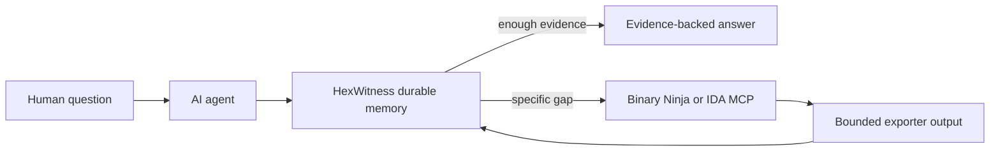

# AI-first reverse engineering

HexWitness is designed for a user to describe an investigation, then let an agent drive the evidence workflow. The CLI remains useful for setup, automation, and recovery; it is not the normal conversational interface.



## The agent contract

For every question, the agent should:

1. confirm HexWitness health and inspect durable memory;
2. select the exact build, preferably by executable SHA-256;
3. resolve the target before traversing its graph;
4. read one evidence dossier with `hexwitness_explain`;
5. inspect the smallest relevant static or runtime relationships;
6. check supporting evidence and contradictions;
7. answer when the retained evidence is sufficient;
8. otherwise generate a gap report, use a live viewer read-only, and promote only the bounded result.
9. for multi-step work, persist the investigation, read failed attempts, use an operation budget, and challenge evidence before completion.
10. use discovery only to find exact records; use local tools only through the bounded receipt-producing runner and never auto-promote their output.

The MCP prompt `hexwitness_start_investigation` encodes this loop. Users do not need to know which individual tool should run first.

## Drop-in prompt

```text
Use HexWitness to investigate this question autonomously:

Which function validates the message length before dispatch, and did the failing
capture reach it?

Select the exact build, reuse retained evidence first, and separate proven facts
from inference. If evidence is missing and a live Binary Ninja or IDA MCP is
connected, inspect only the smallest missing scope. Do not mutate the analysis
database. Finish with the bounded export needed to make any new finding durable.
```

## Use case: explain a crash regression across builds

Ask:

```text
The old build accepts this file and the new build crashes. Find the first changed
function on the path from the parser entry point to the crash and show the evidence.
```

The agent can:

1. use `hexwitness_compare_builds` to locate stable entities that moved or changed signature;
2. compare working and failing captures for the first ordered divergence;
3. resolve the divergent runtime address in each build;
4. find the shortest retained path from the parser to the changed function;
5. open only that function in a live viewer if its IL or xrefs are absent;
6. export that function, its direct edges, and the decisive slice back to HexWitness.

Result: a reproducible regression dossier, not a chat-only decompiler guess.

## Use case: reconstruct an undocumented protocol message

Ask:

```text
Reconstruct message 0x31 from receive through dispatch. Identify the length field,
message identifier, decoder, and final object consumer. Prove each field with static
and runtime evidence.
```

The agent searches retained strings, metadata, codecs, calls, and captures; correlates send/receive events with action markers; then uses dataflow and bounded slices to trace decoded fields. A live viewer is requested only for a missing decoder body or call edge. The final report can distinguish proven offsets from provisional field names.

## Use case: recover a class from a UUID

Ask:

```text
Resolve UUID 6f9619ff-8b86-d011-b42d-00cf4fc964ff, recover the owning class,
its vtable slots and serialized fields, and show what changed between builds.
```

The agent combines `hexwitness_uuid`, class detail, types, offsets, vtable relationships, and build comparison. If a slot target is missing, the live viewer supplies only that slot and target function. The recovered object model remains searchable after the viewer closes.

## Use case: prove why one runtime action works and another fails

Ask:

```text
Compare capture good-login with bad-login. Find the first meaningful divergence,
trace it to its static consumer, and tell me the minimum missing evidence if the cause
is not yet proven.
```

The agent uses the `hexwitness_compare_runtime_behavior` prompt, then capture detail, comparison, timeline, graph, and static resolution. Noise before the first action marker can be excluded. The result identifies the earliest evidence-backed difference instead of comparing entire logs by eye.

## Use case: audit an input boundary without losing provenance

Ask:

```text
Audit every caller of the decompression entry point for integer truncation and
unchecked output lengths. Read-only analysis only. Link every finding to the exact
build, function, and supporting IL or disassembly.
```

The agent inventories callers from HexWitness, checks retained signatures and slices, and uses the live viewer only for missing function bodies. Suspected findings stay provisional until exported and ingested. Renames and patches require separate authorization.

## Use case: hand an investigation to another agent

Ask:

```text
Create a handoff for the authentication state machine: proven states, transitions,
contradictions, runtime coverage, and the three highest-value evidence gaps.
```

The receiving agent can reproduce the result from the same evidence database without reopening the original disassembler session. Activity history shows which HexWitness operations ran while retaining no prompt text, tool arguments, or result bodies.

## Live-viewer promotion

Live MCP output is intentionally not cached as durable truth. After a useful live result, invoke `hexwitness_promote_live_finding`. The prompt produces:

- exact build and target scope;
- required functions, types, xrefs, fields, or bounded slices;
- whether decompiler text is necessary;
- suitable HexWitness exporter;
- provenance fields;
- verification query after ingestion.

This boundary prevents silent collection of proprietary viewer output while ensuring important discoveries survive the session.

## What the agent must not do

- mix addresses from different builds;
- ask a live viewer before searching durable memory;
- export an entire database when one function or type closes the gap;
- treat a symbol name as proof of behavior;
- silently choose one side of contradictory evidence;
- rename, patch, comment, or save a live database without explicit authorization;
- copy binary bytes, credentials, private payloads, or unreviewed captures into a public repository.

For viewer setup, use [Binary Ninja and IDA MCP bridges](VIEWER-MCP.md). For the complete tool vocabulary, use [MCP integration](MCP.md).
