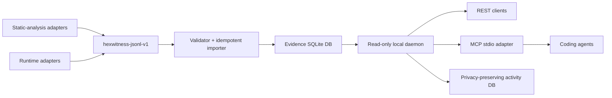

# Architecture

## Boundaries

- **Adapters** know vendor APIs. Core does not.
- **JSONL** is the stable interchange boundary.
- **Importer** is the only standard component that mutates evidence state.
- **Daemon** exposes read-only queries.
- **MCP** mirrors daemon semantics. It never bypasses provenance rules.
- **Activity DB** is separate from evidence. It can be deleted without affecting analysis.

## Why SQLite

Reverse-engineering evidence is local, relational, highly queryable, and usually read-heavy. SQLite provides transactions, indexes, portable single-file storage, and simple backup without operating a separate database service. The interchange format prevents lock-in: rebuild the index from JSONL exports at any time.

## Stable identity

Binary addresses are strings because 64-bit virtual addresses exceed JavaScript's safe integer range. Entity identity is `build_id + stable_key`. Import-generated IDs are deterministic hashes, making repeated imports idempotent.
