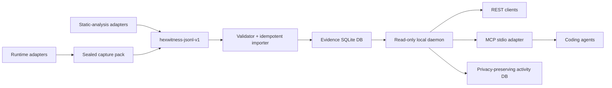

# Architecture

## Boundaries

- **Adapters** know vendor APIs. Core does not.
- **JSONL** is the stable interchange boundary.
- **Capture packs** keep baseline artifacts, markers, hashes, quality gates, and normalized evidence together.
- **Importer** is the only standard component that mutates evidence state.
- **Daemon** exposes read-only queries.
- **MCP** mirrors daemon semantics. It never bypasses provenance rules.
- **Activity DB** is separate from evidence. It can be deleted without affecting analysis.

## Memory model

The evidence database is durable semantic memory: imported facts, relationships, captures, claims, and provenance survive viewer and agent restarts. The activity database is operational history only: hashed arguments, timing, status, and counts. It intentionally cannot reconstruct sensitive queries or returned evidence.

Live viewer calls are not silently cached. Promotion is explicit—export a bounded result through an adapter, ingest it transactionally, then query it through the daemon. This keeps retention reviewable while ensuring previously promoted work is reused first.

## Why SQLite

Reverse-engineering evidence is local, relational, highly queryable, and usually read-heavy. SQLite provides transactions, indexes, portable single-file storage, and simple backup without operating a separate database service. The interchange format prevents lock-in: rebuild the index from JSONL exports at any time.

Entity and normalized-event text use FTS5 indexes with ordinary indexed-query fallback. The one-time schema migration backfills existing databases; later idempotent imports maintain both indexes through triggers.

## Stable identity

Binary addresses are strings because 64-bit virtual addresses exceed JavaScript's safe integer range. Entity identity is `build_id + stable_key`. Import-generated IDs are deterministic hashes, making repeated imports idempotent.

## Generic integration boundary

Target knowledge stays outside core. A project supplies symbols, UUID registries, schemas, semantic hooks, decoders, and controlled observations through adapters. Core provides durable storage, graph semantics, validation, comparison, querying, and agent access without knowing what the target is.
