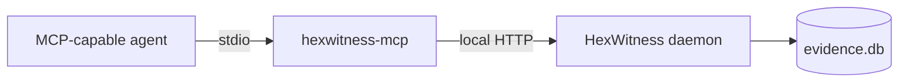

# MCP integration

HexWitness separates the long-running query daemon from the stdio MCP adapter:



This keeps one hot database/cache process available to multiple agents and tools.

## Configure

Copy [`.mcp.json.example`](../.mcp.json.example) into the MCP configuration used by your agent and adjust the absolute script path. Start the daemon before the agent session:

```sh
npm start
```

If HexWitness is installed globally:

```json
{
  "mcpServers": {
    "hexwitness": {
      "command": "hexwitness-mcp",
      "env": {
        "HEXWITNESS_URL": "http://127.0.0.1:7878",
        "HEXWITNESS_AGENT_SESSION": "my-project"
      }
    }
  }
}
```

`HEXWITNESS_AGENT_SESSION` is hashed before retention. It helps distinguish workloads without saving conversation text.

## Available tools

| Tool | Result |
|---|---|
| `hexwitness_health` | Daemon health and indexed counts |
| `hexwitness_builds` | Exact indexed build identities |
| `hexwitness_search` | Build-filtered entity resolution |
| `hexwitness_explain` | Entity dossier with graph, runtime, claims, and provenance |
| `hexwitness_callers` | Direct incoming call edges |
| `hexwitness_callees` | Direct outgoing call edges |
| `hexwitness_xrefs` | Incoming and outgoing code/data references |
| `hexwitness_evidence` | Evidence records filtered by build, source, or classification |
| `hexwitness_contradictions` | Active claim groups with incompatible values |
| `hexwitness_gap_report` | Smallest missing evidence for a stated objective |
| `hexwitness_dump_guide` | Vendor-neutral collection checklist |
| `hexwitness_activity_summary` | Aggregate operation counts, latency, and failures |

The server also exposes the `hexwitness_start_investigation` prompt. It asks the agent to select the exact build, resolve the target, inspect the dossier, traverse only relevant edges, and separate evidence from hypotheses.

## Recommended first request

> Use HexWitness to identify the indexed build, explain the target at `0x401120`, check contradictory claims, and state the smallest missing observation needed to prove the behavior.

See [`AGENTS.md`](../AGENTS.md) for the complete agent contract and [`API.md`](API.md) for endpoint semantics.

## Remote operation

Local operation is preferred. When binding beyond localhost, HexWitness refuses to start unless `HEXWITNESS_API_TOKEN` is set. Use TLS and an authenticated tunnel or reverse proxy; the built-in server does not terminate TLS.

The MCP adapter needs the same token through `HEXWITNESS_API_TOKEN`. It never opens SQLite or performs ingestion directly.
