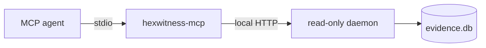

# MCP integration

Start `npm start`, then copy [`.mcp.json.example`](../.mcp.json.example) into the MCP configuration used by your agent. `HEXWITNESS_AGENT_SESSION` is hashed before retention.

## Tool families

| Family | Tools |
|---|---|
| Service | `health`, `builds`, `activity_summary` |
| Resolution | `search`, `query`, `explain` |
| Graph | `callers`, `callees`, `xrefs`, `reach`, `path`, `dataflow`, `slices`, `edge_kinds` |
| Object model | `functions`, `classes`, `class`, `vtable`, `uuid`, `types`, `offsets`, `metadata`, `decomp_search`, `compare_builds` |
| Evidence | `evidence`, `contradictions`, `gap_report`, `dump_guide`, `coverage`, `worklist` |
| Runtime | `captures`, `capture_detail`, `capture_timeline`, `capture_search`, `capture_graph`, `capture_compare` |

All tool names carry the `hexwitness_` prefix.

## Canonical agent sequence

1. `hexwitness_health`
2. `hexwitness_builds`
3. `hexwitness_search` or `hexwitness_query`
4. `hexwitness_explain`
5. the smallest focused graph, object-model, or capture query
6. `hexwitness_evidence` and `hexwitness_contradictions`
7. `hexwitness_gap_report` or `hexwitness_worklist` for unresolved proof

The server also publishes `hexwitness_start_investigation`, a prompt that enforces this sequence.

## Remote operation

Local operation is preferred. A non-local daemon bind refuses startup without `HEXWITNESS_API_TOKEN`. Use TLS through an authenticated tunnel or reverse proxy; the built-in daemon does not terminate TLS. MCP never opens SQLite or mutates evidence directly.
