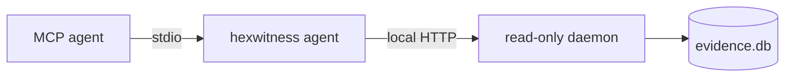

# MCP integration

Official MCP Registry identity: `io.github.siaginw/hexwitness`. The registry package resolves to the public `hexwitness` npm package and starts the stdio server with `hexwitness agent`.

Run `hexwitness setup`. The installed `hexwitness agent` MCP entry starts the local read-only daemon automatically. For manual configuration, use [`.mcp.json.example`](../.mcp.json.example); for a complete memory-plus-viewer workspace, use [`.mcp.ai-first.json.example`](../.mcp.ai-first.json.example) and [the Binary Ninja/IDA bridge guide](VIEWER-MCP.md). `HEXWITNESS_AGENT_SESSION` is hashed before retention.

## Tool families

| Family | Tools |
|---|---|
| Service and memory | `health`, `contract`, `memory_status`, `builds`, `activity_summary` |
| Resolution | `search`, `query`, `explain` |
| Graph | `callers`, `callees`, `xrefs`, `reach`, `path`, `dataflow`, `slices`, `edge_kinds` |
| Object model | `functions`, `classes`, `class`, `vtable`, `uuid`, `types`, `offsets`, `metadata`, `decomp_search`, `compare_builds` |
| Evidence | `evidence`, `contradictions`, `gap_report`, `dump_guide`, `coverage`, `worklist` |
| Runtime | `captures`, `capture_detail`, `capture_timeline`, `capture_search`, `capture_graph`, `capture_compare` |
| Investigation | `playbooks`, `investigations`, `investigation_detail`, `investigation_report`, `failed_attempts`, `evidence_challenge` |
| Investigation mutation | `investigation_create`, `investigation_add_item`, `investigation_update_item`, `investigation_set_status`, `investigation_record_usage`, `failed_attempt_record` |
| Retrieval | `discover`, `discovery_context` (discovery-only; exact follow-up required) |
| Local analysis | `local_tool_status`, `run_local_tool` |

All tool names carry the `hexwitness_` prefix.

Every evidence/query tool advertises read-only, non-destructive, idempotent, closed-world MCP annotations. Investigation-ledger mutations are non-read-only, non-destructive, non-idempotent, and closed-world. `hexwitness_run_local_tool` is deliberately non-read-only, potentially destructive, non-idempotent, and open-world. With `record=true` plus an exact `build_id`, it retains only `tool-observation` evidence; it never creates a claim. The daemon remains GET-only and cannot execute tools.

## Canonical agent sequence

1. `hexwitness_health`
2. `hexwitness_contract` when diagnosing compatibility or automation
3. `hexwitness_memory_status`
4. `hexwitness_builds`
5. `hexwitness_search` or `hexwitness_query`
6. `hexwitness_explain`
7. the smallest focused graph, object-model, or capture query
8. `hexwitness_evidence` and `hexwitness_contradictions`
9. `hexwitness_gap_report` or `hexwitness_worklist` for unresolved proof

The memory tool makes reuse explicit: retained evidence first, live viewer only for a documented gap, then bounded export and ingestion. Activity history proves which operations ran without retaining arguments or result content.

## Agent prompts

| Prompt | Purpose |
|---|---|
| `hexwitness_start_investigation` | Drive a complete memory-first question, escalating only explicit gaps to a live viewer |
| `hexwitness_compare_runtime_behavior` | Compare working/failing captures, find the first divergence, and resolve its static consumer |
| `hexwitness_promote_live_finding` | Convert a transient Binary Ninja or IDA result into a bounded export and ingest handoff |
| `hexwitness_challenge_investigation` | Adversarially review evidence, opposition, contradictions, gaps, and repeated failures |

These prompts let the user state the investigation goal instead of manually sequencing MCP calls. The agent still exposes each individual tool for auditability and advanced control.

## Remote operation

Local operation is preferred. A non-local daemon bind refuses startup without `HEXWITNESS_API_TOKEN`. Use TLS through an authenticated tunnel or reverse proxy; the built-in daemon does not terminate TLS. MCP never opens SQLite or mutates evidence directly.
