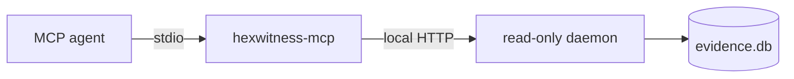

# MCP integration

Run `hexwitness setup`. The installed `hexwitness-agent` MCP entry starts the local read-only daemon automatically. For manual configuration, use [`.mcp.json.example`](../.mcp.json.example); for a complete memory-plus-viewer workspace, use [`.mcp.ai-first.json.example`](../.mcp.ai-first.json.example) and [the Binary Ninja/IDA bridge guide](VIEWER-MCP.md). `HEXWITNESS_AGENT_SESSION` is hashed before retention.

## Tool families

| Family | Tools |
|---|---|
| Service and memory | `health`, `memory_status`, `builds`, `activity_summary` |
| Resolution | `search`, `query`, `explain` |
| Graph | `callers`, `callees`, `xrefs`, `reach`, `path`, `dataflow`, `slices`, `edge_kinds` |
| Object model | `functions`, `classes`, `class`, `vtable`, `uuid`, `types`, `offsets`, `metadata`, `decomp_search`, `compare_builds` |
| Evidence | `evidence`, `contradictions`, `gap_report`, `dump_guide`, `coverage`, `worklist` |
| Runtime | `captures`, `capture_detail`, `capture_timeline`, `capture_search`, `capture_graph`, `capture_compare` |

All tool names carry the `hexwitness_` prefix.

Every tool advertises MCP annotations declaring it read-only, non-destructive, idempotent, and closed-world. These annotations help clients plan safely; the daemon independently enforces GET-only behavior.

## Canonical agent sequence

1. `hexwitness_health`
2. `hexwitness_memory_status`
3. `hexwitness_builds`
4. `hexwitness_search` or `hexwitness_query`
5. `hexwitness_explain`
6. the smallest focused graph, object-model, or capture query
7. `hexwitness_evidence` and `hexwitness_contradictions`
8. `hexwitness_gap_report` or `hexwitness_worklist` for unresolved proof

The memory tool makes reuse explicit: retained evidence first, live viewer only for a documented gap, then bounded export and ingestion. Activity history proves which operations ran without retaining arguments or result content.

## Agent prompts

| Prompt | Purpose |
|---|---|
| `hexwitness_start_investigation` | Drive a complete memory-first question, escalating only explicit gaps to a live viewer |
| `hexwitness_compare_runtime_behavior` | Compare working/failing captures, find the first divergence, and resolve its static consumer |
| `hexwitness_promote_live_finding` | Convert a transient Binary Ninja or IDA result into a bounded export and ingest handoff |

These prompts let the user state the investigation goal instead of manually sequencing MCP calls. The agent still exposes each individual tool for auditability and advanced control.

## Remote operation

Local operation is preferred. A non-local daemon bind refuses startup without `HEXWITNESS_API_TOKEN`. Use TLS through an authenticated tunnel or reverse proxy; the built-in daemon does not terminate TLS. MCP never opens SQLite or mutates evidence directly.
