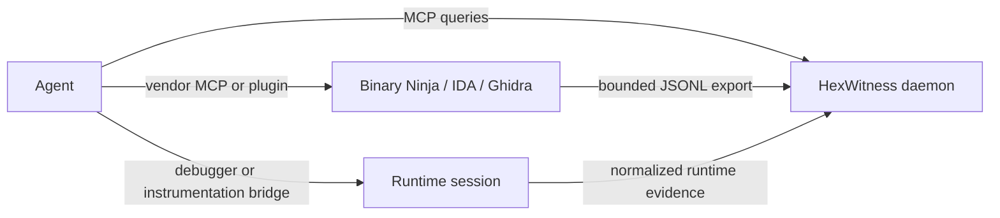

# Working with live reverse-engineering tools

HexWitness provides durable memory. Binary Ninja, IDA, Ghidra, debugger, and Frida integrations provide live inspection. Agents may use both.

Ready-to-adapt Binary Ninja and IDA MCP configurations are documented in [Binary Ninja and IDA MCP bridges](VIEWER-MCP.md).

## Promotion rule

A live-tool answer is transient until exported. After confirming a useful result:

1. Export the bounded function/type/reference set as `hexwitness-jsonl-v1`.
2. Include build hash, tool version, and source address.
3. Ingest it.
4. Query HexWitness to confirm durable reconstruction.

This avoids coupling HexWitness to commercial vendor sessions while allowing agents to use vendor-native MCP servers or plugins. It also ensures an analysis remains useful after the live GUI closes.

Before making a live call, agents should query `hexwitness_memory_status`, select the exact build, and search/explain the target. When memory is sufficient, no vendor call is needed. When it is not, the gap report defines the smallest export required to promote the live result into durable memory.

## Why no universal remote-control proxy

Vendor APIs have different mutation and licensing models. HexWitness's public daemon remains read-only. Live rename, patch, comment, and database-save operations belong in the vendor integration, where users can review permissions. HexWitness receives the resulting evidence through its stable import boundary.
